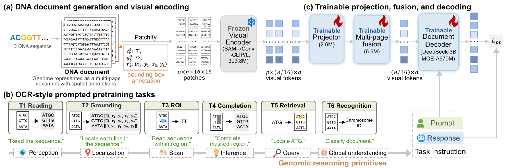

<p align="center">
  
  &nbsp;&nbsp;&nbsp;&nbsp;&nbsp;&nbsp;
  
</p>

<h1 align="center">OpticalDNA</h1>

<h3 align="center">Rethinking Genomic Modeling Through Optical Character Recognition</h3>

<p align="center">
  <a href="https://openreview.net/forum?id=nggzekChuU">
    
  </a>
  <a href="https://arxiv.org/abs/2602.02014">
    
  </a>
  <a href="https://hongxinxiang.github.io/projects/OpticalDNA/">
    
  </a>
  <a href="https://huggingface.co/hxxiang/opticaldna-hg38-2048">
    
  </a>
  <a href="https://huggingface.co/hxxiang/opticaldna-rice-2048">
    
  </a>
</p>

<p align="center">
  <a href="https://github.com/HongxinXiang/OpticalDNA/actions/workflows/ci.yml">
    
  </a>
  <a href="https://github.com/HongxinXiang/OpticalDNA/blob/main/LICENSE">
    
  </a>
  <a href="https://github.com/HongxinXiang/OpticalDNA/stargazers">
    
  </a>
  
  
  <a href="" target='_blank'></a>
</p>

<p align="center">
  <strong>Official ICML 2026 Implementation</strong>
</p>

---

## ✅ Release Status

- [x] **Pretrained checkpoints:** HG38 and Rice models are available on Hugging Face.
- [x] **VisualDNA pipeline:** installation and data-rendering instructions are public.
- [x] **Inference APIs:** visual features, Decoder features, prompt-conditioned generation, and multi-page inputs are supported.

## Project Directory / Table of Contents

- [📢 News](#-news)
- [🧪 1. Summary](#-1-summary)
  - [1.1 Highlights](#11-highlights)
  - [1.2 Citation](#12-citation)
- [🤗 2. Pretrained Models and Usage](#-2-pretrained-models-and-usage)
  - [2.1 Released Models](#21-released-models)
  - [2.2 Quick Start: Visual Features](#22-quick-start-visual-features)
  - [2.3 Feature Extraction Options](#23-feature-extraction-options)
  - [2.4 Decoder Features](#24-decoder-features)
  - [2.5 Prompt-conditioned Generation](#25-prompt-conditioned-generation)
  - [2.6 Transformers API](#26-transformers-api)
- [📁 Repository Structure](#-repository-structure)
- [⚙️ 3. Environment](#%EF%B8%8F-3-environment)
  - [3.1 GPU Environment](#31-gpu-environment)
  - [3.2 Conda Environment Setup](#32-conda-environment-setup)
- [🧬 4. Install VisualDNA](#-4-install-visualdna)
- [🗂️ 5. Data Preparation](#%EF%B8%8F-5-data-preparation)
  - [5.1 Data Layout](#51-data-layout)
  - [5.2 Raw Data Download](#52-raw-data-download)
  - [5.3 Process Raw Data with VisualDNA](#53-process-raw-data-with-visualdna)
  - [5.4 Command Examples](#54-command-examples)
  - [5.5 Notes](#55-notes)
- [🚀 6. Pre-training](#-6-pre-training)
  - [6.1 HG38 Example](#61-hg38-example)
  - [6.2 Rice Example](#62-rice-example)
- [📝 7. Notes for Release Users](#-7-notes-for-release-users)
- [✅ 8. Testing and CI](#-8-testing-and-ci)
- [📄 9. License](#-9-license)

## 📢 News

- **[2026/08/27]** 🤗 Released the pretrained **OpticalDNA-HG38-2048** and **OpticalDNA-Rice-2048** checkpoints on Hugging Face.
- **[2026/05/09]** Repository initialized!
- **[2026/04/30]** 🎉 Paper accepted by **ICML 2026**.

---

## 🧪 1. Summary

OpticalDNA reformulates genomic sequence modeling as a document-understanding problem. DNA sequences are rendered into structured visual pages, encoded by a vision-language backbone, and trained with prompt-conditioned genomic objectives including reading, grounding, ROI transcription, masked completion, subsequence localization, and chromosome-level recognition.


<p align="center">
  
</p>

### 1.1 Highlights

- **DNA as visual documents.** Long genomic sequences are converted into multi-page DNA documents with pixel-level coordinate annotations.
- **Prompt-conditioned genomic pretraining.** Six OCR-style tasks cover recognition, grounding, retrieval, and completion.
- **Efficient long-context representation.** Visual tokens provide compact representations for downstream long-range genomic prediction.
- **Lightweight downstream adaptation.** The pretrained visual encoder can be reused with linear or shallow MLP heads.


### 1.2 Citation

> 📄 **Citation**
>
> ```bibtex
> # ICML
> @inproceedings{xiang2026rethinking,
>   title     = {Rethinking Genomic Modeling Through Optical Character Recognition},
>   author    = {Xiang, Hongxin and Ma, Pengsen and Cao, Yunkang and Yu, Di and Chen, Haowen and Yang, Xinyu and Zeng, Xiangxiang},
>   booktitle = {Proceedings of the 43rd International Conference on Machine Learning},
>   year      = {2026},
>   url       = {https://openreview.net/forum?id=nggzekChuU}
> }
> 
> # arXiv
> @article{xiang2026rethinking_arxiv,
>   title   = {Rethinking Genomic Modeling Through Optical Character Recognition},
>   author  = {Xiang, Hongxin and Ma, Pengsen and Cao, Yunkang and Yu, Di and Chen, Haowen and Yang, Xinyu and Zeng, Xiangxiang},
>   journal = {arXiv preprint arXiv:2602.02014},
>   year    = {2026},
>   url     = {https://arxiv.org/abs/2602.02014}
> }
> ```

---

## 🤗 2. Pretrained Models and Usage

Most users do **not** need to pre-train OpticalDNA from scratch. The released checkpoints can be downloaded automatically from Hugging Face and used directly for genomic feature extraction, prompt-conditioned Decoder representations, and OCR-style genomic inference.

### 2.1 Released Models

| Model | Pretraining corpus | Checkpoint | Feature width | Hugging Face |
|---|---|---:|---:|---|
| **OpticalDNA-HG38-2048** | Human reference genome (HG38) | step 190,000 | 1,280 | [🤗 `hxxiang/opticaldna-hg38-2048`](https://huggingface.co/hxxiang/opticaldna-hg38-2048) |
| **OpticalDNA-Rice-2048** | Rice NIP-T2T (`w2048`, `o1920`) | step 150,000 | 1,280 | [🤗 `hxxiang/opticaldna-rice-2048`](https://huggingface.co/hxxiang/opticaldna-rice-2048) |

Use the **HG38 checkpoint** for human-genome applications and the **Rice checkpoint** for rice/plant genomic applications. Both checkpoints expose the same public OpticalDNA API.

> **Input format.** OpticalDNA operates on rendered DNA document images. Raw DNA sequences can first be converted into OpticalDNA-compatible pages with [VisualDNA](#-4-install-visualdna).

### 2.2 Quick Start: Visual Features

The simplest downstream use is to extract a compact visual genomic representation. This path runs the visual encoder, projector, and page-fusion module, and **does not execute the language Decoder**.

```python
from opticaldna import OpticalDNA

model = OpticalDNA(
    "hxxiang/opticaldna-hg38-2048",
    device="cuda",
)

features = model.extract_features(
    "assets/640x640.png",
    pooling="mean",
    to_cpu=True,
)

print(type(features))
print(features.shape)
```

Expected output:

```text
<class 'torch.Tensor'>
torch.Size([1280])
```

`extract_features(...)` is an alias of `extract_visual_features(...)`. Both return visual representations **before** the language Decoder.

For a multi-page DNA document, pass the pages in reading order:

```python
features = model.extract_features(
    ["page1.png", "page2.png", "page3.png"],
    pooling="mean",
    to_cpu=True,
)

print(features.shape)
# torch.Size([1280])
```

The list represents **one multi-page document**, not a batch. OpticalDNA fuses page-level representations before returning the document features.

### 2.3 Feature Extraction Options

Both released models use a **1,280-dimensional** OpticalDNA representation space. The final tensor shape depends on the pooling strategy.

| `pooling` | Output shape | Description | Typical use |
|---|---|---|---|
| `"mean"` | `[1280]` | Mean over all visual tokens | Recommended compact document embedding for linear probing / MLP heads |
| `"max"` | `[1280]` | Dimension-wise maximum over visual tokens | Emphasizes strongly activated visual/genomic features |
| `"none"` | `[N_visual_tokens, 1280]` | Keeps every fused visual token | Custom attention, token-level analysis, or user-defined pooling |

`N_visual_tokens` is not fixed: it depends on the number of pages and image/crop configuration. The **feature width is always 1,280** for the released HG38 and Rice checkpoints.

Examples:

```python
# Mean-pooled document representation.
feat_mean = model.extract_features(
    "assets/640x640.png",
    pooling="mean",
    to_cpu=True,
)
print(feat_mean.shape)
# torch.Size([1280])

# Max-pooled document representation.
feat_max = model.extract_features(
    "assets/640x640.png",
    pooling="max",
    to_cpu=True,
)
print(feat_max.shape)
# torch.Size([1280])

# Keep all visual tokens.
feat_tokens = model.extract_features(
    "assets/640x640.png",
    pooling="none",
    to_cpu=True,
)
print(feat_tokens.shape)
# torch.Size([N_visual_tokens, 1280])
```

Useful feature-extraction arguments:

| Argument | Default | Meaning |
|---|---:|---|
| `pooling` | `"mean"` | `"mean"`, `"max"`, or `"none"` |
| `to_cpu` | `False` | If `True`, returns a detached CPU tensor; otherwise features remain on the model device |
| `base_size` | `640` | Global image size used by the released inference pipeline |
| `image_size` | `640` | Local/crop image size |
| `crop_mode` | `False` | Enables the local-crop visual path when needed |

For most downstream genomic benchmarks, `pooling="mean"` with `to_cpu=True` is the simplest starting point.

### 2.4 Decoder Features

OpticalDNA can also expose **prompt-conditioned Decoder hidden states**. Unlike pure visual features, this path executes the language Decoder.

```python
from opticaldna import OpticalDNA, PromptGenerator, PromptLength, TaskType

model = OpticalDNA(
    "hxxiang/opticaldna-hg38-2048",
    device="cuda",
)

prompts = PromptGenerator()
prompt = prompts.build(
    TaskType.T1_FULL_OCR,
    PromptLength.SHORT,
    sample={},
)

decoder_features = model.extract_decoder_features(
    "assets/640x640.png",
    prompt=prompt,
    layer=-1,
    pooling="mean",
    image_tokens_only=True,
    to_cpu=True,
)

print(prompt)
print(decoder_features.shape)
```

Expected:

```text
Free OCR.
torch.Size([1280])
```

Decoder feature options:

| Argument | Default | Meaning |
|---|---:|---|
| `layer` | `-1` | Decoder hidden-state layer; `-1` selects the final hidden state |
| `pooling` | `"mean"` | `"mean"`, `"max"`, or `"none"` |
| `image_tokens_only` | `True` | Keep only hidden states aligned with OpticalDNA image tokens |
| `to_cpu` | `False` | Move the returned detached tensor to CPU |

With `pooling="none"` and `image_tokens_only=True`, the output has shape:

```text
[N_image_tokens, 1280]
```

With `image_tokens_only=False`, the token dimension can also include prompt/text positions:

```text
[N_sequence_tokens, 1280]
```

### 2.5 Prompt-conditioned Generation

If `prompt` is omitted, OpticalDNA uses the short T1 prompt:

```text
Free OCR.
```

Generation returns a Python `str`. The simplest generation example is:

```python
text = model.generate(
    "assets/640x640.png",
    max_new_tokens=256,  # Increase this value if a longer generated sequence is expected.
)

print(text)
```

A typical Free-OCR output is a DNA sequence string:

```text
AAGCCAAGAGTCTTCTAATATTTTACATTCACTAAGCAATATGAAAATT...
```

OpticalDNA exposes the six prompt families used during pretraining:

| Task | `TaskType` | Purpose | Possible output |
|---|---|---|---|
| T1 | `T1_FULL_OCR` | Read the full DNA document | DNA sequence text |
| T2 | `T2_FULL_OCR_GROUNDING` | Read DNA and ground lines/regions | Sequence plus bounding boxes |
| T3 | `T3_ROI_OCR` | OCR specified DNA regions | Sequence for each requested box |
| T4 | `T4_MASK_COMPLETION` | Recover masked/occluded DNA | Predicted DNA plus region boxes |
| T5 | `T5_SUBSEQ_LOCATE` | Locate a query subsequence | Matching bounding boxes, or `[]` |
| T6 | `T6_CHR_CLASSIFICATION` | Chromosome classification | Chromosome label; primarily HG38/human-oriented |

Prompt lengths:

```text
PromptLength.SHORT
PromptLength.MEDIUM
PromptLength.LONG
```

Examples:

```python
from opticaldna import PromptGenerator, PromptLength, TaskType

prompts = PromptGenerator()

# T1: Free OCR
free_ocr_prompt = prompts.build(
    TaskType.T1_FULL_OCR,
    PromptLength.SHORT,
    sample={},
)

# T5: subsequence localization
locate_prompt = prompts.build(
    TaskType.T5_SUBSEQ_LOCATE,
    PromptLength.MEDIUM,
    sample={"query": "ACGTACGT"},
)

locate_output = model.generate(
    "assets/640x640.png",
    prompt=locate_prompt,
    max_new_tokens=256,
)

print(locate_output)
```

For T3 ROI OCR and T4 masked completion, provide bounding boxes in:

```python
sample = {
    "boxes": [
        [img_id, x1, y1, x2, y2],
        # ...
    ]
}
```

For multi-page documents, `img_id` is the **0-based page index**.

### 2.6 Transformers API

The Hugging Face repositories also expose the OpticalDNA methods through the standard Transformers custom-model interface.

```python
from transformers import AutoModelForCausalLM, AutoTokenizer

model_id = "hxxiang/opticaldna-hg38-2048"

tokenizer = AutoTokenizer.from_pretrained(
    model_id,
    trust_remote_code=True,
)

model = AutoModelForCausalLM.from_pretrained(
    model_id,
    trust_remote_code=True,
    dtype="auto",
).cuda().eval()

# Pure visual features: language Decoder is not executed.
features = model.extract_features(
    "assets/640x640.png",
    pooling="mean",
    to_cpu=True,
)
print(features.shape)
# torch.Size([1280])

# Build a prompt directly from the remote OpticalDNA model.
prompt = model.build_prompt(
    "t1_full_ocr",
    length="short",
)

# Prompt-conditioned Decoder features.
decoder_features = model.extract_decoder_features(
    tokenizer,
    "assets/640x640.png",
    prompt=prompt,
    layer=-1,
    pooling="mean",
    to_cpu=True,
)

# Decoder output.
text = model.generate_document(
    tokenizer,
    "assets/640x640.png",
    prompt=prompt,
    max_new_tokens=256,
)

print(text)
```

OpticalDNA uses fail-fast checkpoint loading: trained checkpoint parameters are validated during loading rather than silently falling back to partially initialized weights.

---

## 📁 Repository Structure

```text
OpticalDNA/
├── opticaldna/                 # Model, tokenizer, and public inference API
├── src/                        # Training and data-loading source code
│   ├── pretrain_opticaldna.py  # Pre-training entry point
│   └── opticaldna_data/        # Dataset, conversation builder, and data collator
├── scripts/                    # Standalone utility scripts
│   └── data/                   # Data preparation utilities
├── tests/                      # Fast CI tests + released-checkpoint smoke tests
├── .github/workflows/          # GitHub Actions CI
├── assets/                     # README figures and example DNA page
├── environment.yml             # Conda environment specification
├── LICENSE
└── README.md
```

The main directories are:

1. `opticaldna/`: model configuration, tokenizer files, and OpticalDNA model wrappers.
2. `src/`: training entry point and data-loading modules used during pre-training.
3. `scripts/data/`: standalone data preparation scripts for generating processed VisualDNA data.
4. `assets/`: figures used in this README.

## ⚙️ 3. Environment

### 3.1 GPU Environment

- CUDA Toolkit >= 11.8
- CUDA >= 7.5
- Triton: 3.4.0
- Unsloth 2025.10.12
- Transformers: 4.56.2
- Torch >= 2.6.0+cu118

### 3.2 Conda Environment Setup

Install the environment from `environment.yml`:

```bash
conda env create -f environment.yml
conda activate opticaldna
```

Alternatively, you can create the environment manually:

```bash
conda create -n opticaldna python=3.12 -y
conda activate opticaldna

pip install PyMuPDF img2pdf einops easydict addict Pillow
pip install flash-attn==2.7.3 --no-build-isolation --use-pep517 --no-deps

pip install pytabix pandas pyfaidx
pip install kipoiseq==0.5.2
pip install tensorflow==2.16.1
pip install selene-sdk==0.5.3  # Requires torch <= 2.3.1
pip install natsort==8.4.0
pip install pyBigWig==0.3.23
pip install decorator
pip install rdkit
pip install dictionary omegaconf safetensors
pip install timm==1.0.22 --no-deps
pip install tf-keras

pip install datasets==4.3.0
pip install trl==0.24.0 --no-deps
pip install transformers==4.56.2 --no-deps
pip install peft==0.17.1
pip install tokenizers==0.22.1
pip install "unsloth[cu118-torch260]"

# Optional: install PyTorch and related local wheels if needed
pip install torch==2.6.0 torchvision==0.21.0 torchaudio==2.6.0 --index-url https://download.pytorch.org/whl/cu118
# download from https://pytorch-geometric.com/whl/torch-2.6.0%2Bcu118.html
pip install torch_cluster-1.6.3+pt26cu118-cp312-cp312-linux_x86_64.whl
pip install torch_scatter-2.1.2+pt26cu118-cp312-cp312-linux_x86_64.whl
pip install torch_sparse-0.6.18+pt26cu118-cp312-cp312-linux_x86_64.whl
pip install torch_spline_conv-1.2.2+pt26cu118-cp312-cp312-linux_x86_64.whl

pip install numpy==1.26
```

---

## 🧬 4. Install VisualDNA

```bash
pip install visualdna
```

## 🗂️ 5. Data Preparation

### 5.1 Data Layout

OpticalDNA uses data generated by the VisualDNA rendering pipeline. Each dataset contains a `raw/` directory for source files and a `processed/` directory for rendered DNA document images, bounding boxes, and metadata.

A typical dataset directory is organized as follows:

```text
/path/to/opticaldna_dataset/
└── <dataset_name>/
    ├── raw/
    │   ├── <dataset_name>.parquet      # Source genome files, annotations, or metadata
    │   └── ...
    └── processed/
        └── <render_config_name>/
            ├── index.csv              # Metadata index used by OpticalDNA
            ├── images/                # Rendered DNA document images
            └── bbox/                  # Bounding-box annotations
```

In the training scripts, set `--dataroot` to the parent data directory and `--dataset` to the dataset subdirectory name.

For example, if the dataset is stored as:

```text
/path/to/opticaldna_dataset/hg38-2048/
```

then the corresponding arguments should be:

```bash
--dataroot /path/to/opticaldna_dataset
--dataset hg38-2048
```

### 5.2 Raw Data Download

We provide the raw data links used to construct the OpticalDNA pre-training datasets. After downloading the raw files, place them under the corresponding `raw/` directory before running the VisualDNA rendering pipeline.

| Dataset | Description | Raw Data Link | Expected Raw Directory |
|---|---|---|---|
| HG38 | Human reference genome data used for OpticalDNA pre-training | [Download](<https://huggingface.co/datasets/hxxiang/dna_benchmarks/tree/main/raw_data/hg38-2048>) | `/path/to/opticaldna_dataset/hg38-2048/raw/` |
| Rice | Rice genome data used for OpticalDNA pre-training | [Download](https://huggingface.co/datasets/hxxiang/dna_benchmarks/tree/main/raw_data/RiceSuperPIRdb-PRETRAIN_GENOME_TILING/NIP-T2T_w2048_o1920_SeqCase.UPPER) | `/path/to/opticaldna_dataset/rice/raw/` |

### 5.3 Process Raw Data with VisualDNA

The data processing utilities are placed under:

```text
scripts/
└── data/
    ├── generate_processed.py
    └── add_raw_columns_to_processed_index.py
```

The processing workflow contains two steps:

1. Generate the `processed/` directory from raw genome files.
2. Add selected metadata columns from the raw file to the generated `processed/index.csv`.

**Step 1: Generate processed data**

Run `scripts/data/generate_processed.py` to convert raw genome sequences into rendered DNA document images and bounding-box annotations.

#### 5.3.1 HG38 Example

```bash
python scripts/data/generate_processed.py \
  --dataroot /path/to/opticaldna_dataset \
  --dataset hg38-2048 \
  --raw-format parquet \
  --seq-columns seq \
  --img-width 640 \
  --img-height 640 \
  --font-size 14 \
  --line-spacing 1.6 \
  --merge-pages \
  --save-bbox \
  --shard-size auto
```

#### 5.3.2 Rice Example

```bash
python scripts/data/generate_processed.py \
  --dataroot /path/to/opticaldna_dataset \
  --dataset rice \
  --raw-format parquet \
  --seq-columns seq \
  --img-width 640 \
  --img-height 640 \
  --font-size 14 \
  --line-spacing 1.6 \
  --merge-pages \
  --save-bbox \
  --shard-size auto
```

The command above corresponds to the following VisualDNA configuration:

```python
from visualdna.data import ShardedBuilder
from visualdna.render import BaseRenderConfig

config = BaseRenderConfig(
    img_width=640,
    img_height=640,
    font_size=14,
    line_spacing=1.6,
    merge_pages=True,
    save_bbox=True,
)

builder = ShardedBuilder(
    dataroot="/path/to/opticaldna_dataset",
    dataset="hg38-2048",
    render_config=config,
    seq_columns=["seq"],
    raw_csv_url=None,
    force_generate=False,
    shard_size="auto",
    raw_format="parquet",
)
```

After this step, the processed files should be generated under:

```text
/path/to/opticaldna_dataset/
└── hg38-2048/
    ├── raw/
    └── processed/
        └── <render_config_name>/
            ├── index.csv
            ├── images/
            └── bbox/
```

**Step 2: Add metadata columns to `processed/index.csv`**

Some downstream tasks require extra metadata columns, such as chromosome names. These columns can be copied from the raw file into the generated `processed/index.csv`.

Run `scripts/data/add_raw_columns_to_processed_index.py` after Step 1.

**Add `chr_name` for HG38**

```bash
python scripts/data/add_raw_columns_to_processed_index.py \
  --dataroot /path/to/opticaldna_dataset \
  --processed-dataset hg38-2048 \
  --raw-dataset hg38-2048 \
  --render-id <render_config_name> \
  --raw-format parquet \
  --key index \
  --columns chr_name
```

**Add multiple columns**

```bash
python scripts/data/add_raw_columns_to_processed_index.py \
  --dataroot /path/to/opticaldna_dataset \
  --processed-dataset hg38-2048 \
  --raw-dataset hg38-2048 \
  --render-id <render_config_name> \
  --raw-format parquet \
  --key index \
  --columns chr_name,split,species
```

Here:

- `--processed-dataset` is the dataset whose `processed/index.csv` will be updated.
- `--raw-dataset` is the dataset where the source raw file is stored.
- `--render-id` is the generated render configuration directory name under `processed/`.
- `--key` is the column used to match rows between raw data and processed data.
- `--columns` specifies one or more raw metadata columns to add to `processed/index.csv`.

The expected processed index path is:

```text
/path/to/opticaldna_dataset/<processed-dataset>/processed/<render-id>/index.csv
```

The expected raw file path is:

```text
/path/to/opticaldna_dataset/<raw-dataset>/raw/<raw-dataset>.parquet
```

### 5.4 Command Examples

Most pre-training workflows are expected to run on Linux servers. Windows `cmd` examples are also provided for users who prepare data locally.

**Linux/macOS examples**

**Generate processed data**

```bash
python scripts/data/generate_processed.py \
  --dataroot /path/to/opticaldna_dataset \
  --dataset hg38-2048 \
  --raw-format parquet \
  --seq-columns seq \
  --img-width 640 \
  --img-height 640 \
  --font-size 14 \
  --line-spacing 1.6 \
  --merge-pages \
  --save-bbox \
  --shard-size auto
```

**Add metadata columns**

```bash
python scripts/data/add_raw_columns_to_processed_index.py \
  --dataroot /path/to/opticaldna_dataset \
  --processed-dataset hg38-2048 \
  --raw-dataset hg38-2048 \
  --render-id render_w640_h640_fs14_ls1.6_hash_f345fcfc \
  --raw-format parquet \
  --key index \
  --columns chr_name
```

**Windows CMD examples**

If you run the commands in Windows `cmd`, use `^` for line continuation.

**Generate processed data**

```cmd
python scripts\data\generate_processed.py ^
  --dataroot F:\path\to\opticaldna_dataset ^
  --dataset hg38-2048 ^
  --raw-format parquet ^
  --seq-columns seq ^
  --img-width 640 ^
  --img-height 640 ^
  --font-size 14 ^
  --line-spacing 1.6 ^
  --merge-pages ^
  --save-bbox ^
  --shard-size auto
```

**Add metadata columns**

```cmd
python scripts\data\add_raw_columns_to_processed_index.py ^
  --dataroot F:\path\to\opticaldna_dataset ^
  --processed-dataset hg38-2048 ^
  --raw-dataset hg38-2048 ^
  --render-id render_w640_h640_fs14_ls1.6_hash_f345fcfc ^
  --raw-format parquet ^
  --key index ^
  --columns chr_name
```

### 5.5 Notes

- `raw/{dataset}.parquet` should exist before running `generate_processed.py`.
- The `processed/` directory is generated automatically by VisualDNA.
- The `render-id` should match the directory name generated under `processed/`.
- The same scripts can be used for HG38, rice, or any other dataset by changing parser arguments.
- Keep these scripts under `scripts/data/` because they are command-line data preparation utilities rather than model or training modules.

## 🚀 6. Pre-training

OpticalDNA is initialized from the DeepSeek-OCR checkpoint. Download the checkpoint from [this link](https://1drv.ms/u/c/53030532e7d1aed6/IQCG1Ja7O8kUQo1_OAPl-1EDAa9pzp4oNGJl5JWr0Tr-yZQ?e=Wr4Hpe) and place the extracted checkpoint directory under `opticaldna/`.


### 6.1 HG38 Example

```bash
conda activate opticaldna

model_name=./opticaldna
output_dir=./outputs/pretrain_opticaldna/hg38
dataroot=/path/to/opticaldna_data
dataset=hg38-2048

CUDA_VISIBLE_DEVICES=0,1,2,3,4,5,6,7 \
OMP_NUM_THREADS=8 MKL_NUM_THREADS=8 \
PYTHONUNBUFFERED=1 \
python -m torch.distributed.run --standalone --nproc_per_node=8 --master_port=29501 \
src/pretrain_opticaldna.py --backend nccl \
  --dataloader_num_workers 12 --dataloader_prefetch_factor 4 \
  --per_device_train_batch_size 8 --save_total_limit 10 --save_steps 1000 \
  --warmup_steps 20000 --output_dir ${output_dir} \
  --dataroot ${dataroot} --dataset ${dataset} \
  --model_name ${model_name} \
  --task_sampling "p_t1=0.17,p_t2=0.17,p_t3=0.17,p_t4=0.17,p_t5=0.17,p_t6=0.15" \
  --tail_truncation "enabled=true,base_delete_ratio=0,max_delete_ratio=0.98" \
  --line_span_cfg "min_n_base=1,max_n_base=8,min_n_sample=1,max_n_sample=3,unique_lines=true" \
  --subseq_locate_cfg "min_len=6,max_len=32,allow_overlap=true" \
  --lora_r 128 --trainable_modules_to_save page_fusion_layer \
  --learning_rate 5e-4 --max_steps 281250 --annealed_sampler_total_steps 1 \
  --lora_projector
```

### 6.2 Rice Example

```bash
conda activate opticaldna

model_name=./opticaldna
output_dir=./outputs/pretrain_opticaldna/rice
dataroot=/path/to/opticaldna_data
dataset=rice-2048  # we use NIP-T2T_w2048_o1920_SeqCase.UPPER
max_steps=235405

CUDA_VISIBLE_DEVICES=0,1,2,3,4,5,6,7 \
OMP_NUM_THREADS=8 MKL_NUM_THREADS=8 \
PYTHONUNBUFFERED=1 \
python -m torch.distributed.run --standalone --nproc_per_node=8 --master_port=29501 \
src/pretrain_opticaldna.py --backend nccl \
  --dataloader_num_workers 12 --dataloader_prefetch_factor 4 \
  --per_device_train_batch_size 8 --save_total_limit 10 \
  --warmup_steps 20000 --output_dir ${output_dir} \
  --dataroot ${dataroot} --dataset ${dataset} \
  --model_name ${model_name} \
  --task_sampling "p_t1=0.17,p_t2=0.17,p_t3=0.17,p_t4=0.17,p_t5=0.17,p_t6=0.15" \
  --tail_truncation "enabled=true,base_delete_ratio=0,max_delete_ratio=0.9" \
  --line_span_cfg "min_n_base=1,max_n_base=8,min_n_sample=1,max_n_sample=3,unique_lines=true" \
  --subseq_locate_cfg "min_len=6,max_len=32,allow_overlap=true" \
  --lora_r 128 --trainable_modules_to_save page_fusion_layer \
  --learning_rate 5e-4 --max_steps ${max_steps} --lora_projector --lora_decoder
```

## 📝 7. Notes for Release Users

- Replace example paths with local paths when needed.
- Large model weights and generated datasets are hosted externally and are not committed to GitHub.
- Loading custom OpticalDNA checkpoints through Transformers requires `trust_remote_code=True`.

## ✅ 8. Testing and CI

Fast tests run automatically on every GitHub push and pull request. They check syntax, the Hugging Face configuration/public API contract, and fail-fast checkpoint validation without downloading model weights. Pull requests and `main` also run a lightweight CPU runtime-import check.

```bash
python -m pytest tests/unit
```

Before a model release, run the real-checkpoint smoke test:

```bash
python tests/smoke/test_checkpoint_loading.py \
  --model hxxiang/opticaldna-hg38-2048 \
  --device cuda \
  --image assets/640x640.png
```

See `tests/README.md` for the rice checkpoint and optional generation test.

## 📄 9. License

This repository is released under the MIT License. Parts of the model implementation are adapted from third-party open-source projects; please also follow the corresponding upstream licenses and notices where applicable.
